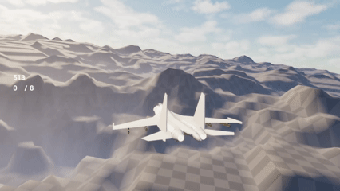
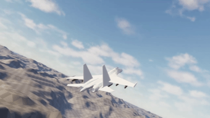

# UnrealEngineFlightProject

Website for the project is located [at this link](https://unrealenginepersonalflightproject.netlify.app/)

A custom flight simulation project built in Unreal Engine 5 using C++ and Blueprints.
The goal of this project is to explore advanced gameplay programming and implementing flight mechanics and physics in the Unreal Engine.
Inspirations of my project come from flight games/simulators such as War Thunder, Ace Combat, and Project Wingman.

## Goals
Some of my goals of the project are:
- Learning UE5 C++ programming and separation of logic
- Learning how to implement aircraft flight physics
- Building HUD and UI systems needed for flight simulators
- Gain experience in designing modular and scalable game systems
- Gain experience in optimization in game making

## Features

### Thrust / Speed
Currently, the calculations for velocity use a Engine State Model in order to make slowing down and speeding up more pronounced. Each state has a designated speed when the speed nears that target, drag is applied using a Sigmoid Function.
Each aircraft has a maximum speed and acceleration value, with the acceleration showing the acceleration at standard thrust, with afterburning and air braking causing the acceleration to change drastically. Drag is also applied from both Angle of Attack and depending on the climb/dive angle of the aircraft. I have recently added a turn curve to have values at which the Aircraft can turn the best and a compression curve when the aircraft is too fast (which I might just put into the standard turn curve). Drag has also been greatly increased since previous updates and affect the user a bit more when not afterburning. The idea is for the player to have two types, one and two circle performance aircraft, which have their pros and cons. This will, in theory, introduce more complexity in the player's engagement as they either manage with a single target, or multiple.

### Angle of Attack (AoA)
Flight models have a simple implementation of Angle of Attack, i.e. the direction that the aircraft is heading doesn't not match where the aircraft's nose is pointing. In my implementation, angle of attack is shown through two lines,
the green line is where the nose is pointing while the blue line is the forward vector. If left untouched, the forward vector will naturally go back to being the same as the aircraft's nose forward, which a variable determing how fast this 
calculation happens is determined by a data asset in the Unreal Editor. There is also an indicator for both where the aircraft is pointing and where the forward vector is now, helping the user distinguish between the two. Below are some visual examples of my implementation:

Another Angle of Attack variable is the current orientation of the aircraft, as I've implemented a "downwards force" for the Angle of Attack when the aircraft starts going inverted toward the ground as seen below:

### G-Forces
The G-Force is calculated every tick for aircraft, which is displayed on the HUD currently and I hope to add more visual events tied to this force. I am going to change the G-Force HUD to only display in first person, which will have a more "realistic" HUD like in modern jet fighters as I don't think displaying this in Third Person would help the user much. Currently the G-Force affects when the wing vortices are created, which is currently 8Gs, but I also hope to tie wing vapors to be created when high Gs are experienced.

### First and Third Person
There is a first and third person mode which have keybinds set up to switch between the two. First person has an additional pitch ladder added to the UI which isn't present in third. currently there isn't anything in the interior, which I will change later and add a small map in the cockpit to make it a bit more immersive. Below is some footage of the implementation:

### Levels
As of right now there is a Main Menu which has a free flight button, which shows all the maps (1 test map currently), which then leads to the aircraft selection menus, which then loads the actual map. I plan for the Main Menu to have more, including settings, the actual campaign button, and maybe some sort of presets for certain controllers to make it more convenient for controller and HOTAS players. The aircraft selection menu has aircraft selection, which also bring up a buy pop up for certain aircraft, weapon picking, and special picking. I plan for the weapon picking to change drastically, as I hope to group weapons to certain pylons so that the user isn't manually selecting a weapon for each pylon. There are currently no specials so that screen just has the start mission button. The Mission is just a test height map I have currently.

### Basic Missile Functionality
There are two groups of missiles as of now, however they function the same except for visually. Infrared (IR) Missiles and Active Radar Homing (ARH) Missiles, both lock on and track a target after firing and upon hit deal damage. They also destroy themselves upon impacting the ground and can be fired without lock. Missiles have exhaust effects and destruction effects. ARH Missiles first go through a "drop" phase instead of immediately going off the rail like IR, currently they also use Projectile Movement and use stats from data assets. The plan for ARH missiles is to eventually have multilock on for all available missiles on pylons in order to have some distinction that ARH missiles are faster to fire due to their long range, Active Homing nature, and multiple data links on modern aircraft. As of now there is no plan to make how many ARH missiles can be simultaneously launched at once, however this may change if it helps gameplay and makes progression more significant.

### Re-Equipping and Grouping
Weapons are grouped with each other, making it so the player can fire all of the same type at once instead of switching constantly. Weapons can also re-equip after a cooldown, which is stored in a data asset.

### Shooting
Aircraft can shoot now and these bullets deal damage, destroy upon impact, and use impulse to traverse. They have a simple visual effect and aircraft have the ability to change bullets, each of which has its own data asset for stats. In the future I will add a visual in order to indicate lead needed to hit a target, mimicing a radar gun sight.

### Visual Examples

### Basic AI
Very primative AI as of now, it calculates the roll needed to pitch up into its given target and can move, however it doesn't implement ideas such as lag pursuit or changes state from attack.

## Tech Stack
- Unreal Engine 5 (C++ and Blueprints)
  - Niagara FX
  - UMG for HUD
  - Microsoft Visual Studio 2022
- Blender
  - All models and are made by me.
  - Most effects are also created by me, with one exception
  - Afterburner Effect
    - Created by *Vigilante* from the *Fighter EuroFighter (West)* Fab Pack
    - Downloaded from *Unreal Engine Fab Marketplace*
    - Link to Download here: https://fab.com/s/92a5edec4f74
- Photoshop

## Future Plans
Some of my future goals are:
- Expanding and making a "tree" of options for aircraft, for example:
  - The F-15C is the "base" with the options of the F-15E (Strike) and F-15N (Experimental Naval) being available
- A more polished version of air combat with energy being more in play
- Advanced weather and extreme weather conditions, affecting AI and user experience
- Missile Tracking and Fooling via flares and chaff
- Implement a more robust HUD and display more necessary values to the user
- I do have ideas of a story to make this project more into a releasable product, as of now this is only an idea
- Another idea is to implement co-op, either through two separate screens or one shared screen on something like a TV, I will play around with the idea and see if it's too much out of the scope of this project to do
