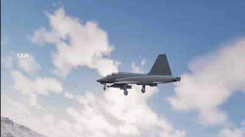
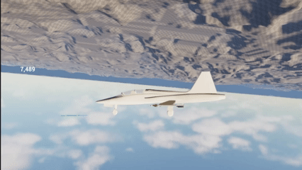
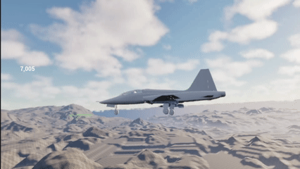

# UnrealEngineFlightProject

A custom flight simulation project built in Unreal Engine 5 using C++ and Blueprints.
The goal of this project is to explore advanced gameplay programming and implementing flight mechanics and physics in the Unreal Engine.
Inspirations of my project come from flight games/simulators such as War Thunder, Ace Combat, and Project Wingman.

## Goals
Some of my goals of the project are:
- Learning UE5 C++ programming and separation of logic
- Learning how to implement aircraft flight physics
- Building HUD and UI systems needed for flight simulators
- Gain experience in designing modular and scalable game systems
- Gain experience in optimization in game making

## Features (WIP)

### Thrust / Speed
Currently, the calculations for velocity use a Engine State Model in order to make slowing down and speeding up more pronounced. Each state has a designated speed when the speed nears that target, drag is applied using a Sigmoid Function.
Each aircraft has a maximum speed and acceleration value, with the acceleration showing the acceleration at standard thrust, with afterburning and air braking causing the acceleration to change drastically.

### Angle of Attack (AoA)
Flight models have a simple implementation of Angle of Attack, i.e. the direction that the aircraft is heading doesn't not match where the aircraft's nose is pointing. In my implementation, angle of attack is shown through two lines,
the green line is where the nose is pointing while the blue line is the forward vector. If left untouched, the forward vector will naturally go back to being the same as the aircraft's nose forward, which a variable determing how fast this 
calculation happens is determined by a data asset in the Unreal Editor. Below are some visual examples of my implementation:

Another Angle of Attack variable is the current orientation of the aircraft, as I've implemented a "downwards force" for the Angle of Attack when the aircraft starts going inverted toward the ground as seen below:

### Aircraft Selection / Display
Currently there is a level that displays all available aircraft (so far only 2) and from that, select weapons and a special. This is then transfered from the gamemode's player state to the overall game instance in order to equip the right 
items in actual combat level. Hovering over options displays the object temporarily and clicking keeps that selection on screen, there are also aircraft designated "permanent", meaning they can't be sold and come free, while all the other aircraft have a cost and the button is clickable once the player has the right amount of currency.

### Basis Missile Functionality
Missiles are primitive, but do simulate a launch sequence as of now. The missiles get pushed a downward force that is relative to the aircraft, simulating the push that missiles are given in real life to separate them and avoid collision.
The missile also inherits the velocity of the aircraft when launched.

## Tech Stack
- Unreal Engine 5 (C++ and Blueprints)
  - Niagara FX
  - UMG for HUD
  - Microsoft Visual Studio 2022
- Blender
  - All models and aircraft visual effects are made by me.
- Photoshop

## Future Plans
Some of my future goals are:
- Expanding and making a "tree" of options for aircraft, for example:
  - The F-15C is the "base" with the options of the F-15E (Strike) and F-15N (Experimental Naval) being available
- A more polished version of air combat with energy being more in play
- Advanced weather and extreme weather conditions, affecting AI and user experience
- Missile Tracking and Fooling via flares and chaff
- Increase the effect that roll has on Angle of Attack
- Implement a more robust HUD and display more necessary values to the user
